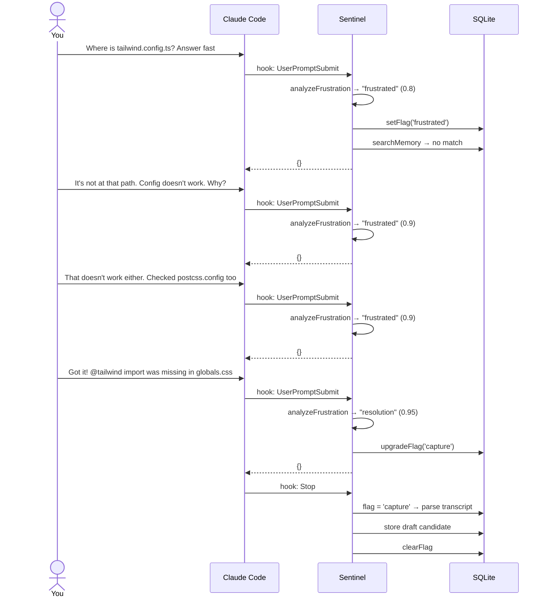
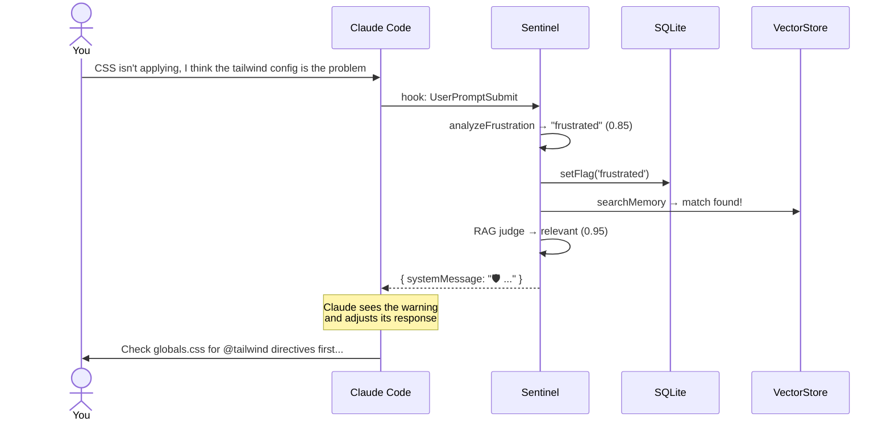
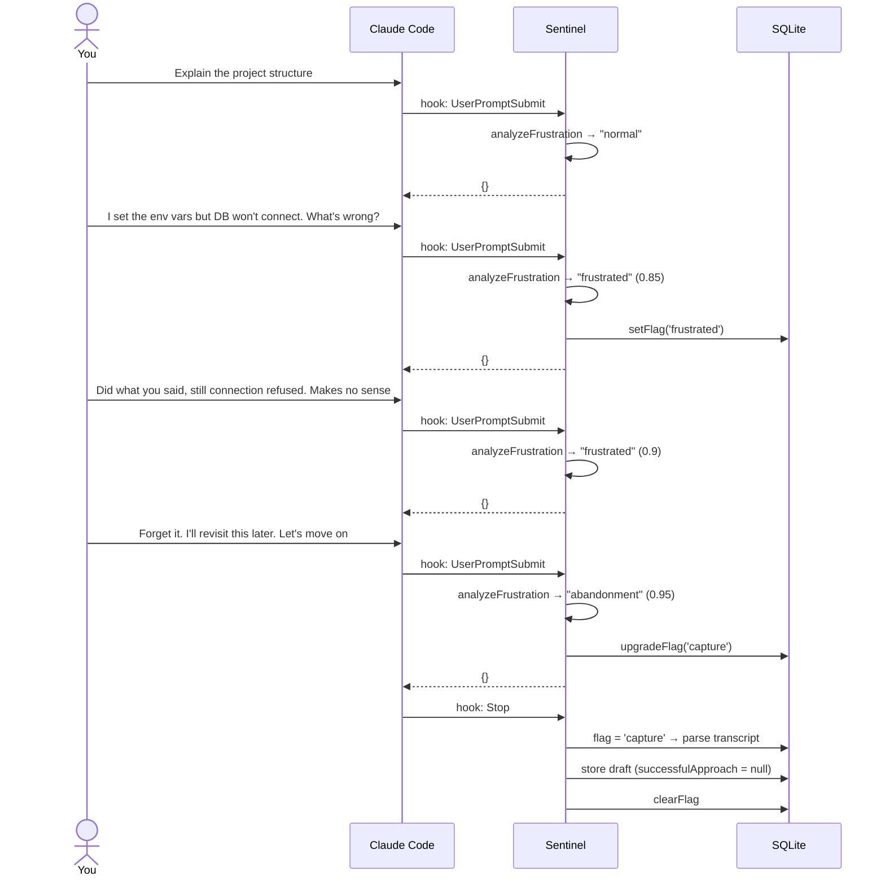

# Examples

Real usage scenarios showing how Dev Sentinel works with Claude Code.

---

## Scenario 1: Experience Capture (Frustration → Resolution)

You're debugging a Tailwind CSS issue. After several frustrated attempts, you find the fix.



### Session

```
You:     Where is tailwind.config.ts? Answer fast
Claude:  (responds)

You:     It's not at that path. I've been looking but the config doesn't work. Why?
Claude:  (responds)

You:     That doesn't work either. Checked postcss.config too, still not applying
Claude:  (responds)

You:     Got it! The @tailwind import was missing in globals.css. Fixed, thanks
Claude:  (responds)
```

### What happens behind the scenes

```
Prompt 1 → frustrated (confidence 0.8)  → setFlag('frustrated')
Prompt 2 → frustrated (confidence 0.9)  → flag already set
Prompt 3 → frustrated (confidence 0.9)  → flag already set
Prompt 4 → resolution (confidence 0.95) → upgradeFlag('capture')
         → Stop hook fires → transcript saved as draft → flag cleared
```

### Review the draft

```
$ sentinel review list
──────────────────────────────────────────────────
Draft: 627c8596-...
Created: 2025-06-14T...
Issue: Trying to find tailwind.config.ts and fix CSS not applying
(raw transcript saved — LLM summary runs on confirm)
──────────────────────────────────────────────────

$ sentinel review confirm 627c8596-...
Summarizing transcript with LLM...
Draft "627c8596-..." confirmed and stored as experience.
```

### Stored experience

```json
{
  "frustrationSignature": "Tailwind CSS styles not applying despite configuration files being present",
  "failedApproaches": [
    "Looking for tailwind.config.ts file",
    "Checking postcss.config file",
    "Assuming configuration files were the issue"
  ],
  "successfulApproach": "Found missing @tailwind imports in globals.css file",
  "lessons": [
    "When Tailwind styles aren't applying, check globals.css for missing @tailwind directives",
    "Configuration files are not always the root cause",
    "Check CSS imports before diving into configuration files"
  ]
}
```

---

## Scenario 2: Active Recall

Days later, you hit a similar CSS issue. Sentinel warns you before you go down the same rabbit hole.



### Session

```
You:     CSS isn't applying, I think the tailwind config file is the problem
```

### What happens

```
Prompt → frustrated (confidence 0.85)
      → vector search → match found (Scenario 1 experience)
      → RAG judge → relevant (confidence 0.95)
      → warning injected into Claude's context
```

### What Claude sees

```
╭─ 🛡️ Dev Sentinel ──────────────────────────────────────────╮
│                                                             │
│  Similar issue found from a past session.                   │
│                                                             │
│  ▸ Tailwind CSS styles not applying despite configuration   │
│    files being present                                      │
│                                                             │
│  → Before checking the tailwind config file, first verify   │
│    that your globals.css includes the required @tailwind     │
│    directives.                                              │
│                                                             │
├─────────────────────────────────────────────────────────────┤
│  Lessons:                                                   │
│  • Check globals.css for missing @tailwind directives       │
│  • Configuration files are not always the root cause        │
│  • Check CSS imports before diving into configuration       │
╰─────────────────────────────────────────────────────────────╯
```

Your prompt passes through to Claude unchanged — the warning is injected as a system message that guides Claude's response.

---

## Scenario 3: Experience Capture (Frustration → Abandonment)

Sometimes you don't find the fix. Sentinel captures these too.



### Session

```
You:     Explain the project structure
Claude:  (responds normally)

You:     I set the environment variables but the DB won't connect. What's wrong?
Claude:  (responds)

You:     Did what you said, still getting connection refused. Makes no sense
Claude:  (responds)

You:     Forget it. I'll revisit this later. Let's move on
Claude:  (responds)
```

### What happens

```
Prompt 1 → normal                        → pass through
Prompt 2 → frustrated (confidence 0.85)  → setFlag('frustrated')
Prompt 3 → frustrated (confidence 0.9)   → flag already set
Prompt 4 → abandonment (confidence 0.95) → upgradeFlag('capture')
         → Stop hook fires → transcript saved as draft → flag cleared
```

### Draft stored with no successful approach

```
$ sentinel review list
──────────────────────────────────────────────────
Draft: a1b2c3d4-...
Created: 2025-06-15T...
Issue: Trying to connect to database but getting connection refused
(raw transcript saved — LLM summary runs on confirm)
──────────────────────────────────────────────────
```

When you confirm, the experience is stored with `successfulApproach: null` — so next time you hit a DB connection issue, Sentinel can warn you about what **didn't** work, even without a known fix.
